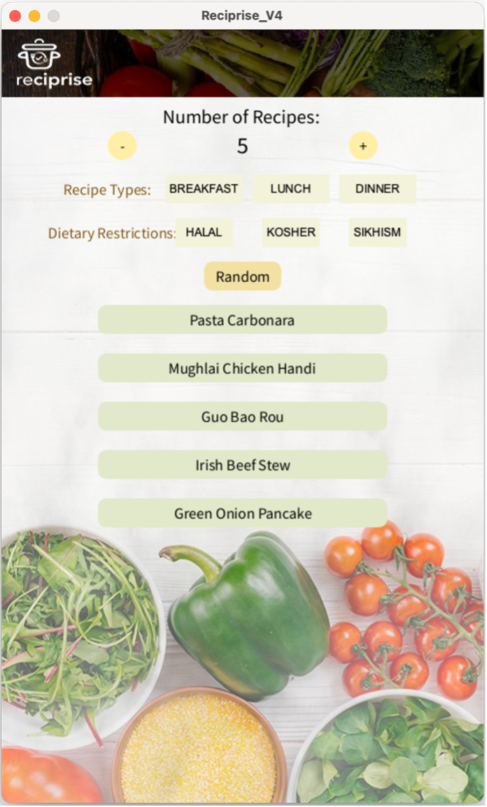

# 🍽️ Reciprise

## Project Description
**Reciprise** is a **Processing** project designed to inspire users when they’re unsure about what to eat. It allows users to select meal types (e.g., breakfast, lunch, dinner) and dietary restrictions (e.g., halal, kosher, Sikhism) to generate random recipe suggestions. Each recipe comes with a clickable link to a video tutorial, making it easy to explore and prepare the dishes.

## Features
- **Custom Meal Selection**: Filter recipes by meal type or dietary preference.
- **Random Recipe Suggestions**: Discover random recipes from a curated list with the click of a button.
- **Adjustable Results**: Display between 1 to 10 recipes at a time.
- **Direct Recipe Links**: Open tutorial videos for each recipe directly in your browser.
- **Interactive UI**: User-friendly buttons and visuals for an engaging experience.

## Technologies Used
- **Processing**: The primary framework for the graphical interface and program logic.
- **ControlP5 Library**: Used for creating interactive buttons and controls.
- **Java Utilities**: For shuffling arrays and managing data.
- **System Commands**: To open recipe links in the user's default browser.

## How to Use

1. **Choose Meal Type or Dietary Preference**:  
   Click buttons like `Breakfast`, `Lunch`, `Halal`, etc., to filter recipes.

2. **Adjust Number of Recipes**:  
   Use the `+` and `-` buttons to set the number of recipes displayed (1–10).

3. **Shuffle Recipes**:  
   Click the `Random` button to generate a new list of recipes.

4. **Explore Recipes**:  
   Click on any recipe name to open its tutorial video in your default browser.

## Preview

